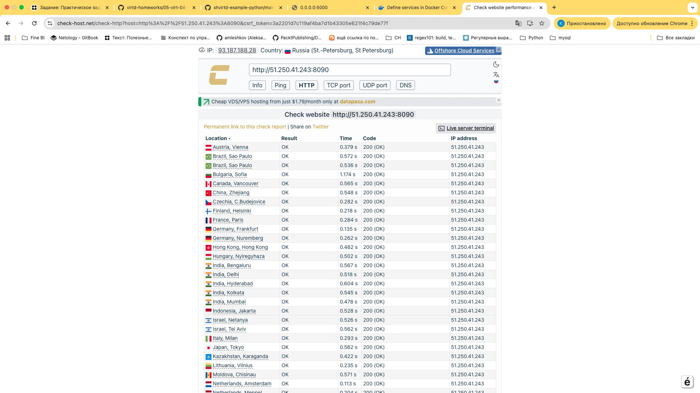
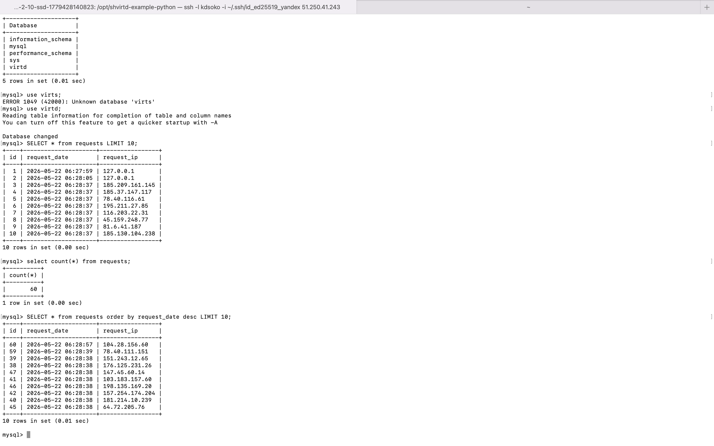
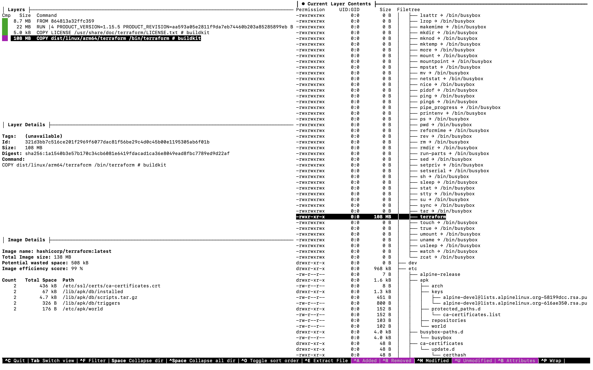
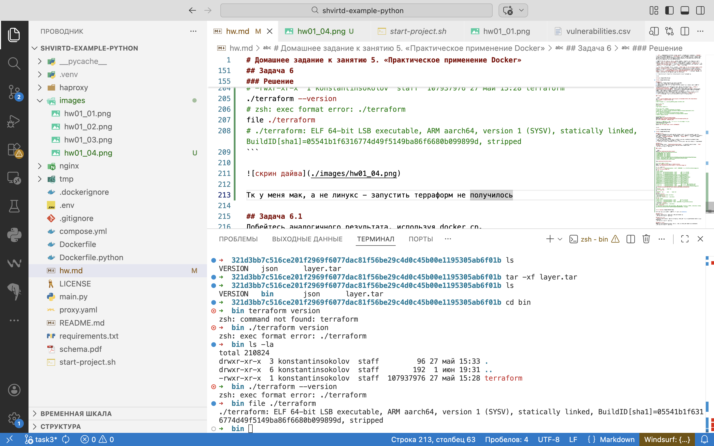
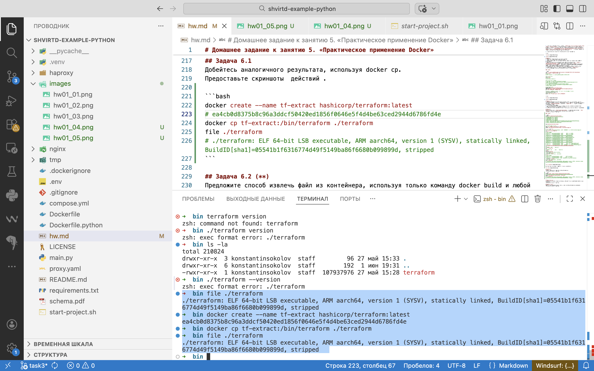

# Домашнее задание к занятию 5. «Практическое применение Docker»

### Инструкция к выполнению

1. Для выполнения заданий обязательно ознакомьтесь с [инструкцией](https://github.com/netology-code/devops-materials/blob/master/cloudwork.MD) по экономии облачных ресурсов. Это нужно, чтобы не расходовать средства, полученные в результате использования промокода.
3. **Своё решение к задачам оформите в вашем GitHub репозитории.**
4. В личном кабинете отправьте на проверку ссылку на .md-файл в вашем репозитории.
5. Сопроводите ответ необходимыми скриншотами.

---
## Примечание: Ознакомьтесь со схемой виртуального стенда [по ссылке](https://github.com/netology-code/shvirtd-example-python/blob/main/schema.pdf)

---

## Задача 0
1. Убедитесь что у вас НЕ(!) установлен ```docker-compose```, для этого получите следующую ошибку от команды ```docker-compose --version```
```
Command 'docker-compose' not found, but can be installed with:

sudo snap install docker          # version 24.0.5, or
sudo apt  install docker-compose  # version 1.25.0-1

See 'snap info docker' for additional versions.
```
В случае наличия установленного в системе ```docker-compose``` - удалите его.  
2. Убедитесь что у вас УСТАНОВЛЕН ```docker compose```(без тире) версии не менее v2.24.X, для это выполните команду ```docker compose version```  
###  **Своё решение к задачам оформите в вашем GitHub репозитории!!!!!!!!!!!!!!!!!!!!!!!!!!!!!!!!**

---

## Задача 1
1. Сделайте в своем GitHub пространстве fork [репозитория](https://github.com/netology-code/shvirtd-example-python).

2. Создайте файл ```Dockerfile.python``` на основе существующего `Dockerfile`:
   - Используйте базовый образ ```python:3.12-slim```
   - Обязательно используйте конструкцию ```COPY . .``` в Dockerfile
   - Создайте `.dockerignore` файл для исключения ненужных файлов
   - Используйте ```CMD ["uvicorn", "main:app", "--host", "0.0.0.0", "--port", "5000"]``` для запуска
   - Протестируйте корректность сборки
2.1 Используйте multistage сборку вместо single stage.
3. (Необязательная часть, *) Изучите инструкцию в проекте и запустите web-приложение без использования docker, с помощью venv. (Mysql БД можно запустить в docker run).
4. (Необязательная часть, *) Изучите код приложения и добавьте управление названием таблицы через ENV переменную.
---
### ВНИМАНИЕ!
!!! В процессе последующего выполнения ДЗ НЕ изменяйте содержимое файлов в fork-репозитории! Ваша задача ДОБАВИТЬ 5 файлов: ```Dockerfile.python```, ```compose.yaml```, ```.gitignore```, ```.dockerignore```,```bash-скрипт```. Если вам понадобилось внести иные изменения в проект - вы что-то делаете неверно!

---

## Задача 2 (*)
1. Создайте в yandex cloud container registry с именем "test" с помощью "yc tool" . [Инструкция](https://cloud.yandex.ru/ru/docs/container-registry/quickstart/?from=int-console-help)
2. Настройте аутентификацию вашего локального docker в yandex container registry.
3. Соберите и залейте в него образ с python приложением из задания №1.
4. Просканируйте образ на уязвимости.
5. В качестве ответа приложите отчет сканирования.

Решение
```bash
# инициализация
yc init --username=sokkos199@yandex.ru
# проверка что все ок
yc config list

# создание реджистри
yc container registry create --name my-first-registry
yc container registry configure-docker
# проверяем что все ок
cat ~/.docker/config.json | jq

# тегируем образ и загружаем его
docker tag shvirtd-example-python_app cr.yandex/crpdbsr7te7lntdvuebb/shvirtd-example-python_app:hello
docker push cr.yandex/crpdbsr7te7lntdvuebb/shvirtd-example-python_app:hello
# должно появиться тут
# https://console.yandex.cloud/folders/b1gh060klv456091o7av/container-registry/registries
```

[Отчет](./tmp/vulnerabilities.csv), [скриншот](./images/hw01_01.png)

## Задача 3
1. Изучите файл "proxy.yaml"
2. Создайте в репозитории с проектом файл ```compose.yaml```. С помощью директивы "include" подключите к нему файл "proxy.yaml".
3. Опишите в файле ```compose.yaml``` следующие сервисы: 

- ```web```. Образ приложения должен ИЛИ собираться при запуске compose из файла ```Dockerfile.python``` ИЛИ скачиваться из yandex cloud container registry(из задание №2 со *). Контейнер должен работать в bridge-сети с названием ```backend``` и иметь фиксированный ipv4-адрес ```172.20.0.5```. Сервис должен всегда перезапускаться в случае ошибок.
Передайте необходимые ENV-переменные для подключения к Mysql базе данных по сетевому имени сервиса ```web``` 

- ```db```. image=mysql:8. Контейнер должен работать в bridge-сети с названием ```backend``` и иметь фиксированный ipv4-адрес ```172.20.0.10```. Явно перезапуск сервиса в случае ошибок. Передайте необходимые ENV-переменные для создания: пароля root пользователя, создания базы данных, пользователя и пароля для web-приложения.Обязательно используйте уже существующий .env file для назначения секретных ENV-переменных!

2. Запустите проект локально с помощью docker compose , добейтесь его стабильной работы: команда ```curl -L http://127.0.0.1:8090``` должна возвращать в качестве ответа время и локальный IP-адрес. Если сервисы не стартуют воспользуйтесь командами: ```docker ps -a ``` и ```docker logs <container_name>``` . Если вместо IP-адреса вы получаете информационную ошибку --убедитесь, что вы шлете запрос на порт ```8090```, а не 5000.

5. Подключитесь к БД mysql с помощью команды ```docker exec -ti <имя_контейнера> mysql -uroot -p<пароль root-пользователя>```(обратите внимание что между ключем -u и логином root нет пробела. это важно!!! тоже самое с паролем) . Введите последовательно команды (не забываем в конце символ ; ): ```show databases; use <имя вашей базы данных(по-умолчанию virtd, как это указано в .env)>; show tables; SELECT * from requests LIMIT 10;```. Примечание: таблица в БД создается после первого поступившего запроса к приложению.

6. Остановите проект. В качестве ответа приложите скриншот sql-запроса.

скрины 





## Задача 4
1. Запустите в Yandex Cloud ВМ (вам хватит 2 Гб Ram).
2. Подключитесь к Вм по ssh и установите docker.
3. Напишите bash-скрипт, который скачает ваш fork-репозиторий в каталог /opt и запустит проект целиком.
4. Зайдите на сайт проверки http подключений, например(или аналогичный): ```https://check-host.net/check-http``` и запустите проверку вашего сервиса ```http://<внешний_IP-адрес_вашей_ВМ>:8090```. Таким образом трафик будет направлен в ingress-proxy. Трафик должен пройти через цепочки: Пользователь → Internet → Nginx → HAProxy → FastAPI(запись в БД) → HAProxy → Nginx → Internet → Пользователь
5. (Необязательная часть) Дополнительно настройте remote ssh context к вашему серверу. Отобразите список контекстов и результат удаленного выполнения ```docker ps -a```
6. Повторите SQL-запрос на сервере и приложите скриншот и ссылку на fork.

### Решение

```bash
scp -i ~/.ssh/id_ed25519_yandex start-project.sh kdsoko@51.250.41.243:/home/kdsoko/
ssh -l kdsoko -i <path-to-ssh> <ip>
# например
# ssh -l kdsoko -i ~/.ssh/id_ed25519_yandex 51.250.41.243

# проверяем докер
which docker
# если нет
# apt install docker.io

# проверяем докер компоуз
# sudo mkdir -p /usr/local/lib/docker/cli-plugins
# sudo curl -SL "https://github.com/docker/compose/releases/download/v2.24.5/docker-compose-linux-x86_64" \
#   -o /usr/local/lib/docker/cli-plugins/docker-compose
# sudo chmod +x /usr/local/lib/docker/cli-plugins/docker-compose
# docker compose version

# скачиваем проект
PROJECT_DIR=/opt/shvirtd-example-python
REPO_URL=https://github.com/sokkos1995/shvirtd-example-python.git
git clone "$REPO_URL" "$PROJECT_DIR"

# или просто запускаем скрипт , который до этого прикопали в хомяке 
/home/kdsoko/start-project.sh 
# проверка данных в БД
docker exec -ti mysql mysql -uroot -pYtReWq4321
```

скрины 


## Задача 5 (*)
1. Напишите и задеплойте на вашу облачную ВМ bash скрипт, который произведет резервное копирование БД mysql в директорию "/opt/backup" с помощью запуска в сети "backend" контейнера из образа ```schnitzler/mysqldump``` при помощи ```docker run ...``` команды. Подсказка: "документация образа."
2. Протестируйте ручной запуск
3. Настройте выполнение скрипта раз в 1 минуту через cron, crontab или systemctl timer. Придумайте способ не светить логин/пароль в git!!
4. Предоставьте скрипт, cron-task и скриншот с несколькими резервными копиями в "/opt/backup"

## Задача 6
Скачайте docker образ ```hashicorp/terraform:latest``` и скопируйте бинарный файл ```/bin/terraform``` на свою локальную машину, используя dive и docker save.
Предоставьте скриншоты  действий .

### Решение

```bash
docker pull hashicorp/terraform:latest
# latest: Pulling from hashicorp/terraform
# 26c998063986: Pull complete 
# ca9979e80c96: Pull complete 
# 6d60f122e292: Pull complete 
# ba3a113dfe2c: Pull complete 
# Digest: sha256:15bf5a08b1fb9c9747c8ff01098aeeefb4aec9a6c24eb13e7661bdf9447e4aee
# Status: Downloaded newer image for hashicorp/terraform:latest
# docker.io/hashicorp/terraform:latest

dive hashicorp/terraform:latest

# сохраняем файл в хомяке
mkdir -p ~/hw06-terraform && cd ~/hw06-terraform
docker save hashicorp/terraform:latest -o terraform-image.tar

ls -la | grep terr
# -rw-------    1 konstantinsokolov  staff  139084800  1 июн 19:29 terraform-image.tar
tar -xf terraform-image.tar 
ls -la
# total 296096
# drwxr-xr-x   10 konstantinsokolov  staff        320  1 июн 19:30 .
# drwxr-x---+ 105 konstantinsokolov  staff       3360  1 июн 19:30 ..
# drwxr-xr-x    5 konstantinsokolov  staff        160 27 май 15:33 321d3bb7c516ce201f2969f6077dac81f56be29c4d0c45b00e1195305ab6f01b
# -rw-r--r--    1 konstantinsokolov  staff       4288 27 май 15:33 5592d68ba708bec67f72d21efd21623d427defed1d9abc360334311dca0101df.json
# drwxr-xr-x    5 konstantinsokolov  staff        160 27 май 15:33 864813a32ffc359f399f04ee8f9ea51c5d26d10247f0f2a815b7f32f581992c5
# drwxr-xr-x    5 konstantinsokolov  staff        160 27 май 15:33 c268ed8db0964e7e83c9fb6327faddd4adde8621823f0d18ed6726ce298231f2
# drwxr-xr-x    5 konstantinsokolov  staff        160 27 май 15:33 d0b80498e1ac44fcfeddf959a7fa6f839ef10e22eac1e138f504787f10a9a21d
# -rw-r--r--    1 konstantinsokolov  staff        446  1 янв  1970 manifest.json
# -rw-r--r--    1 konstantinsokolov  staff        102  1 янв  1970 repositories
# -rw-------    1 konstantinsokolov  staff  139084800  1 июн 19:29 terraform-image.tar
cd 321d3bb7c516ce201f2969f6077dac81f56be29c4d0c45b00e1195305ab6f01b  
ls   
# VERSION   json      layer.tar
tar -xf layer.tar 
ls   
# VERSION   bin       json      layer.tar
cd bin 
terraform version
# zsh: command not found: terraform
./terraform version
# zsh: exec format error: ./terraform
ls -la
# total 210824
# drwxr-xr-x  3 konstantinsokolov  staff         96 27 май 15:33 .
# drwxr-xr-x  6 konstantinsokolov  staff        192  1 июн 19:31 ..
# -rwxr-xr-x  1 konstantinsokolov  staff  107937976 27 май 15:28 terraform
./terraform --version
# zsh: exec format error: ./terraform
file ./terraform
# ./terraform: ELF 64-bit LSB executable, ARM aarch64, version 1 (SYSV), statically linked, BuildID[sha1]=05541b1f6316774d49f5149ba86f6680b099899d, stripped
```



Тк у меня мак, а не линукс - запустить терраформ не получилось



## Задача 6.1
Добейтесь аналогичного результата, используя docker cp.  
Предоставьте скриншоты  действий .

```bash
docker create --name tf-extract hashicorp/terraform:latest
# ea4cb0d8375b8c96a3ddcf50420ed1856f0646e5f4d4be63ced2944d6786fd4e
docker cp tf-extract:/bin/terraform ./terraform
file ./terraform
# ./terraform: ELF 64-bit LSB executable, ARM aarch64, version 1 (SYSV), statically linked, BuildID[sha1]=05541b1f6316774d49f5149ba86f6680b099899d, stripped
```



## Задача 6.2 (**)
Предложите способ извлечь файл из контейнера, используя только команду docker build и любой Dockerfile.  
Предоставьте скриншоты  действий .

## Задача 7 (***)
Запустите ваше python-приложение с помощью runC, не используя docker или containerd.  
Предоставьте скриншоты  действий .